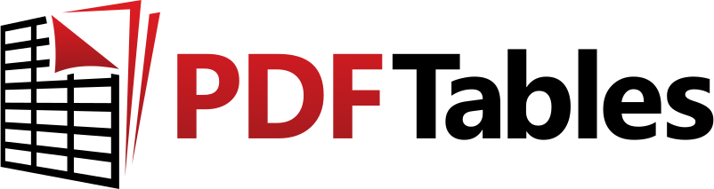

# PDFTables API repositories

This organisation contains several code examples in different languages
for use with the [PDFTables API](https://pdftables.com/api). 

## Third-party repositories you may find useful

:warning: These third-party repositories are not developed
nor supported by The Sensible Code Company,
but you may find them useful reference examples.

* [R package](https://github.com/expersso/pdftables)
* [Elixir
  example](https://github.com/mudssrali/mix_install_examples/blob/main/pdftables_api.exs)

